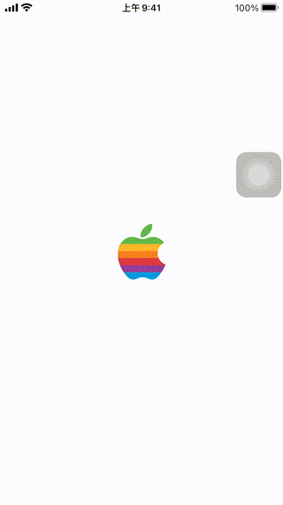

# WWSignInWith3rd_Apple

[](https://developer.apple.com/swift/) [](https://developer.apple.com/swift/) [](https://developer.apple.com/swift/) [](https://developer.apple.com/swift/)

Use native Apple third-party login.

使用原生的Apple第三方登入。



### [Installation with Swift Package Manager](https://medium.com/彼得潘的-swift-ios-app-開發問題解答集/使用-spm-安裝第三方套件-xcode-11-新功能-2c4ffcf85b4b)
```
dependencies: [
    .package(url: "https://github.com/William-Weng/WWSignInWith3rd_Apple.git", .upToNextMajor(from: "1.0.0"))
]
```

### Example
```swift
import UIKit
import WWPrint
import WWSignInWith3rd_Apple

final class ViewController: UIViewController {

    override func viewDidLoad() {
        super.viewDidLoad()
    }
    
    @IBAction func signInWithApple(_ sender: UIButton) {
        
        WWSignInWith3rd.Apple.shared.login { result in
            wwPrint(result)
        }
    }
}
```
